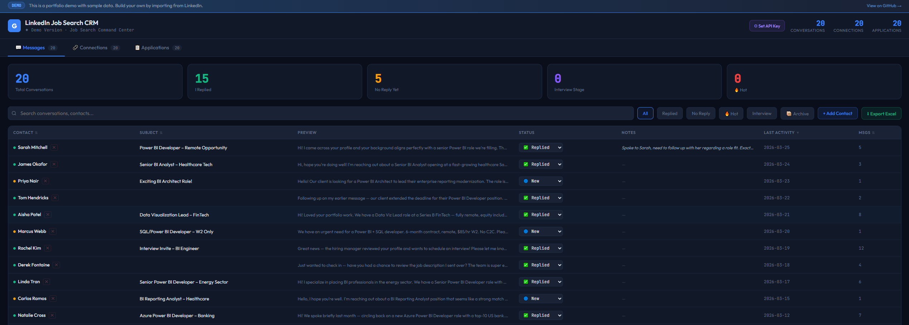
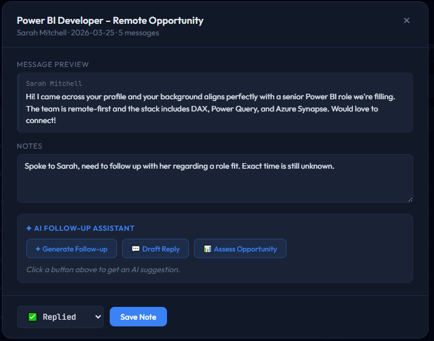
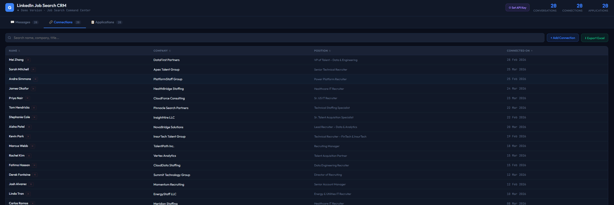
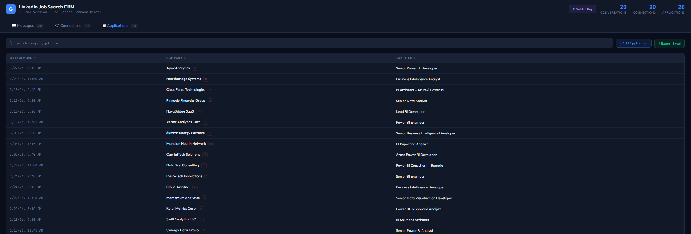
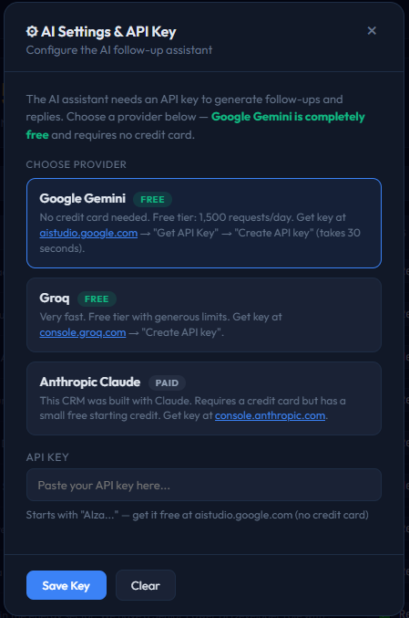

# Portfolio – Guilbert Maglasang

Senior Business Intelligence Developer specializing in Power BI, DAX, SQL, and data storytelling. This portfolio showcases dashboards, analytics projects, and browser-based tools built to solve real problems.

---

## 🚀 Featured Project

### [LinkedIn Job Search CRM](https://gmaglasang.github.io/App_Build/linkedin-crm/)
A fully functional, browser-based CRM built to manage a high-volume job search — 392 conversations, 862 connections, and 200 applications tracked in a single HTML file with no backend required.

**Features:** Message tracking with status tags (Hot, Interview, Replied, Ghosted) · Connection manager · Application log · AI follow-up assistant (Gemini/Anthropic/Groq) · Excel export · Zero dependencies

**Built with:** AI-assisted development · Runs entirely in the browser · No installation required

[**→ Open Live Demo**](https://gmaglasang.github.io/App_Build/linkedin-crm/)

### Screenshots

**Messages Tab** — Track conversations with status tags (Hot, Interview, Replied, Ghosted) and one-click filtering

**Contact Detail & AI Follow-up Assistant** — View message history, add notes, and generate AI-powered follow-ups

**Connections Tab** — Manage 862+ LinkedIn connections with company, title, and date context

**Applications Tab** — Track 200+ job applications with company, title, and date applied

**AI Settings** — Connect your own API key (Google Gemini free tier supported, no credit card required)

---

## 📊 BI & Analytics Projects

### Corteva Agriscience – Vendor Scorecard Dashboard
Executive-level vendor performance dashboard tracking KPIs across supply chain operations.
**Tools:** Power BI, DAX, SQL

### Sales Performance Analysis Dashboard
End-to-end sales analytics dashboard with dynamic filtering, YoY trend analysis, and executive-level KPI tracking — migrated from Excel to Power BI.
**Tools:** Power BI, Power Query, DAX, SQL

---

## 🛠 App Build Projects

### [LinkedIn Job Search CRM](https://gmaglasang.github.io/App_Build/linkedin-crm/)
See featured project above.

### Mouth Breathing Tracker
Web application built to track mouth-open frequency over time — helping mouth breathers monitor progress.
**Built with:** AI-assisted development · Integrates MediaPipe Face Mesh for real-time facial landmark detection

---

## Core Skills

| Area | Tools |
|---|---|
| BI & Reporting | Power BI, DAX, Power Query, Paginated Reports |
| Data & Databases | SQL, Snowflake, SQL Server |
| Automation | Power Automate |
| AI-Assisted Dev | Shipped browser-based tools using AI coding assistance |

---

*📫 Connect with me on [LinkedIn](https://www.linkedin.com/in/guilbert-maglasang/) · [gmaglasang1@gmail.com](mailto:gmaglasang1@gmail.com)*
