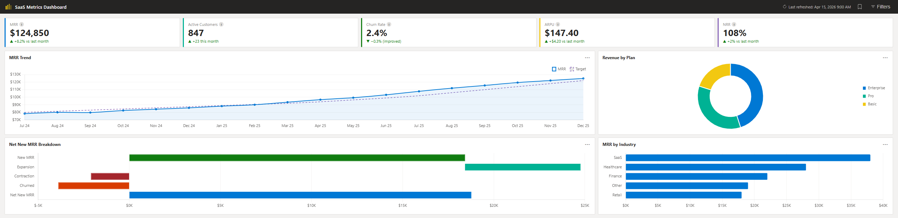
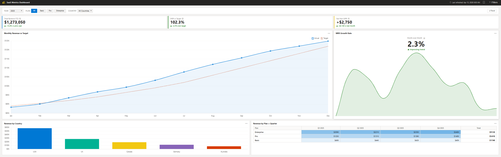
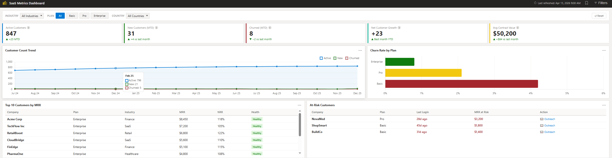

# Portfolio – Guilbert Maglasang

Senior Business Intelligence Developer specializing in Power BI, DAX, SQL, and data storytelling. This portfolio showcases dashboards, analytics projects, and browser-based tools built to solve real problems.

---

## 🚀 Featured Projects

### [SaaS Metrics Dashboard](https://gmaglasang.github.io/App_Build/saas-metrics/demo.html) · *BI Live Demo*
A Power BI-style executive dashboard showcasing SaaS business metrics — MRR trends, customer health, churn analysis, and revenue breakdowns across three interactive report pages.

**Features:** 4 dynamic filters (Year, Country, Plan, Industry) · 3 dashboard pages · Live KPI cards · Chart.js visualizations · Zero dependencies

**Built with:** Vanilla HTML/JS · Power BI-inspired design system · Chart.js · Runs entirely in the browser

> 📌 *This demo was built to show exactly how a Power BI SaaS dashboard looks and behaves — interactive filters, multi-page navigation, and live chart updates — without requiring Power BI Desktop or workspace access.*

[**→ Open Live Demo**](https://gmaglasang.github.io/App_Build/saas-metrics/demo.html) · [**→ Download .pbix**](https://github.com/gmaglasang/powerbi-saas-metrics)

#### Screenshots

**Executive Overview** — MRR trends, active customer count, churn rate KPIs, and revenue by plan and industry

**Revenue Breakdown** — Year-over-year MRR vs. target with growth rate trends and country-level distribution

**Customer Health** — Active customer trends, churn by plan, top customers by MRR, and at-risk account identification

---

### [LinkedIn Job Search CRM](https://gmaglasang.github.io/App_Build/linkedin-crm/demo.html) · *App Live Demo*
A fully functional, browser-based CRM built to manage a high-volume job search — 392 conversations, 862 connections, and 200 applications tracked in a single HTML file with no backend required.

**Features:** Message tracking with status tags (Hot, Interview, Replied, Ghosted) · Connection manager · Application log · AI follow-up assistant (Gemini/Anthropic/Groq) · Excel export · Zero dependencies

**Built with:** AI-assisted development · Runs entirely in the browser · No installation required

> 📌 *Built out of necessity — spreadsheets couldn't keep up. No CRM felt right for a recruiter-heavy job search, so I built one that did.*

[**→ Open LinkedIn Job Search CRM**](https://gmaglasang.github.io/App_Build/linkedin-crm/demo.html)

#### Screenshots

**Messages Tab** — Track conversations with status tags (Hot, Interview, Replied, Ghosted) and one-click filtering

**Contact Detail & AI Follow-up Assistant** — View message history, add notes, and generate AI-powered follow-ups

**Connections Tab** — Manage 862+ LinkedIn connections with company, title, and date context

**Applications Tab** — Track 200+ job applications with company, title, and date applied

**AI Settings** — Connect your own API key (Google Gemini free tier supported, no credit card required)

---

## 📐 DAX & Data Modeling

### [Power BI SaaS Metrics – .pbix File](https://github.com/gmaglasang/powerbi-saas-metrics)
The actual Power BI file behind the SaaS Metrics Dashboard — open it in Power BI Desktop to explore the star schema data model, relationships, and DAX measures directly.

**Model:** Star schema · `Fact_Subscriptions` snapshot table · `Dim_Customers`, `Dim_Plans`, `Dim_Date` · 41 DAX measures

[**→ Download .pbix**](https://github.com/gmaglasang/powerbi-saas-metrics)

---

### [Power BI DAX Showcase](https://github.com/gmaglasang/powerbi-dax-showcase)
8 production DAX measures extracted directly from two real Power BI models — a SaaS Metrics Dashboard and a Vendor Quality Scorecard — each fully annotated with the pattern used, why it's non-trivial, and what DAX concept it demonstrates.

**Patterns covered:** Filter context manipulation · Row context → filter context transition · `CALCULATETABLE` + `ADDCOLUMNS` · Volume-weighted aggregation · Point-in-time snapshots · Cohort analysis · Disconnected slicer with `ISINSCOPE`

**Models:** 41 measures (SaaS) · 123 measures (Vendor QA)

[**→ View DAX Showcase**](https://github.com/gmaglasang/powerbi-dax-showcase)

---

## 📊 BI & Analytics Projects

### Corteva Agriscience – Vendor Scorecard Dashboard
Executive-level vendor performance dashboard tracking KPIs across supply chain operations.
**Tools:** Power BI, DAX, SQL

### Sales Performance Analysis Dashboard
End-to-end sales analytics dashboard with dynamic filtering, YoY trend analysis, and executive-level KPI tracking — migrated from Excel to Power BI.
**Tools:** Power BI, Power Query, DAX, SQL

---

## 🛠 App Build Projects

### [SaaS Metrics Dashboard](https://gmaglasang.github.io/App_Build/saas-metrics/demo.html) · *BI Live Demo*
See featured project above. A Power BI-style SaaS executive dashboard with interactive filters and multi-page navigation.

### [LinkedIn Job Search CRM](https://gmaglasang.github.io/App_Build/linkedin-crm/demo.html) · *App Live Demo*
See featured project above. A browser-based CRM for managing a high-volume job search.

### [Mouth Breathing Tracker](https://gmaglasang.github.io/App_Build/mouth-breathing-tracker.html)
Web application built to track mouth-open frequency over time — helping mouth breathers monitor progress.
**Built with:** AI-assisted development · Integrates MediaPipe Face Mesh for real-time facial landmark detection

---

## Core Skills

| Area | Tools |
|---|---|
| BI & Reporting | Power BI, DAX, Power Query, Paginated Reports |
| Data & Databases | SQL, Snowflake, SQL Server |
| Automation | Power Automate |
| AI-Assisted Dev | Shipped browser-based tools using AI coding assistance |

---

*📫 Connect with me on [LinkedIn](https://www.linkedin.com/in/guilbert-maglasang/) · [gmaglasang1@yahoo.com](mailto:gmaglasang1@yahoo.com)*
